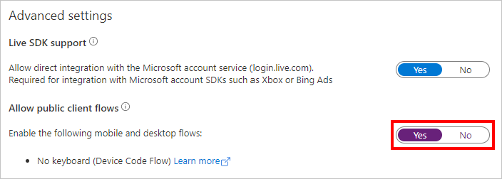

# Microsoft Graph delta query sample

[](https://github.com/microsoftgraph/msgraph-sample-deltaquery/actions/workflows/dotnet.yml) 

This console application demonstrates how to make [delta queries](https://learn.microsoft.com/graph/delta-query-overview) to Microsoft Graph, allowing applications to request only changed entities within a target resource. This sample monitors changes to the mail folders in a user's mailbox.

## How To Run This Sample

To run this sample you will need:

- The [.NET 7.0 SDK](https://dotnet.microsoft.com/download)
- A user in a Microsoft 365 tenant with an Exchange Online mailbox.

### Step 1: Register the sample application in Azure Active Directory

Before running the sample, you will need to create an app registration in Azure Active Directory to obtain a client ID. You can do this with the PowerShell script in this sample, or you can register it manually in the Azure Active Directory portal.

#### Option 1: Register with PowerShell

The [RegisterApp.ps1](RegisterApp.ps1) script uses the [Microsoft Graph PowerShell SDK](https://learn.microsoft.com/microsoftgraph/overview) to create the app registration. You will need to [install the Microsoft Graph PowerShell SDK](https://learn.microsoft.com/powershell/microsoftgraph/installation) to use this script.

> **IMPORTANT**: The PowerShell script requires a work/school account with the **Application administrator**, **Cloud application administrator**, or **Global administrator** role. If your account has the **Application developer** role, you can register in the Azure AD admin center.

1. Open [PowerShell 7](https://learn.microsoft.com/powershell/scripting/install/installing-powershell-on-windows) in the root directory of this sample.

1. Run the following command to set the execution policy for the current PowerShell window to allow the script to run.

    ```powershell
    Set-ExecutionPolicy -ExecutionPolicy RemoteSigned -Scope Process
    ```

1. Run the script with the following command.

    ```powershell
    ./RegisterApp.ps1 -AppName "Delta Query Console Sample"
    ```

1. Follow the prompt to open `https://microsoft.com/devicelogin` in a browser, enter the provided code, and complete the authentication process.

1. The application ID is printed to the console.

    ```powershell
    SUCCESS
    Client ID: 2fb1652f-a9a0-4db9-b220-b224b8d9d38b
    Tenant ID: common
    ```

#### Option 2: Register with the Azure Active Directory admin center

1. Open a browser and navigate to the [Azure Active Directory admin center](https://aad.portal.azure.com) and login using a Microsoft 365 user that has permission to register an application in Azure Active Directory.

1. Select **Azure Active Directory** in the left-hand navigation, then select **App registrations** under **Manage**.

    

1. Select **New registration**. On the **Register an application** page, set the values as follows.

    - Set **Name** to `Delta Query Console Sample`.
    - Set **Supported account types** to **Accounts in any organizational directory and personal Microsoft accounts**.
    - Leave **Redirect URI** empty.

    

1. Select **Register**. On the **Delta Query Console Sample** page, copy the value of the **Application (client) ID** and save it, you will need it in the next step.

    

1. Select **Authentication** under **Manage**. Locate the **Advanced settings** section and change the **Allow public client flows** toggle to **Yes**, then choose **Save**.

    

### Step 2: Configure the sample

Open [appsettings.json](src/appsettings.json) and replace `YOUR_CLIENT_ID_HERE` with the client ID of your app registration.

### Step 3: Run the sample

When the sample runs, it will prompt you to browse to a login URL and enter a device code. Once signed in, the app will check for changes to the mail folders in the user's mailbox every 30 seconds.

#### Option 1: Using Visual Studio Code

1. Open the root folder of this sample using Visual Studio Code.

1. On the **Debug** menu, choose **Start Debugging**.

#### Option 2: From the command line

1. Open your command-line interface (CLI) in the directory that contains **DeltaQuery.csproj**.

1. Run the following command to build the sample.

    ```Shell
    dotnet build
    ```

1. Run the following command to run the sample.

    ```Shell
    dotnet run
    ```

## Code of conduct

This project has adopted the [Microsoft Open Source Code of Conduct](https://opensource.microsoft.com/codeofconduct/). For more information see the [Code of Conduct FAQ](https://opensource.microsoft.com/codeofconduct/faq/) or contact [opencode@microsoft.com](mailto:opencode@microsoft.com) with any additional questions or comments.

## Disclaimer

**THIS CODE IS PROVIDED _AS IS_ WITHOUT WARRANTY OF ANY KIND, EITHER EXPRESS OR IMPLIED, INCLUDING ANY IMPLIED WARRANTIES OF FITNESS FOR A PARTICULAR PURPOSE, MERCHANTABILITY, OR NON-INFRINGEMENT.**
